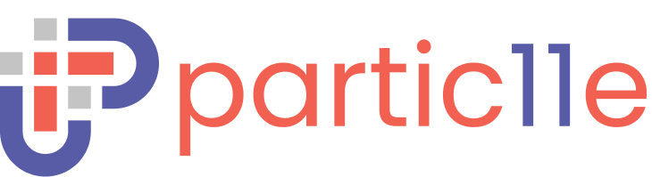

  

  

## Philosophy

[IntegerEleven][i11n] develops many things in [Deno][deno], and has developed many utility libraries. partic11e is a rewriting of these libraries for public use with an emphasis
on simplicity and consistency across the public APIs. Additional utility and feature libraries are being added to the partic11e collection to
make it easier to **build everything**.

## Contributing

Contributions are welcome! Take a look at the contributing guidelines under a module.

  
  

[deno]: https://deno.land
[i11n]: https://github.com/i11n
